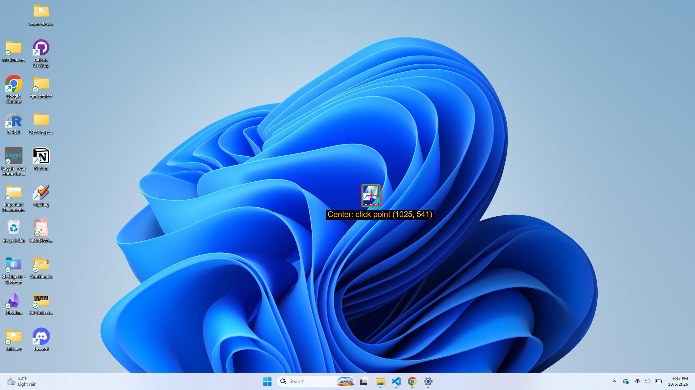
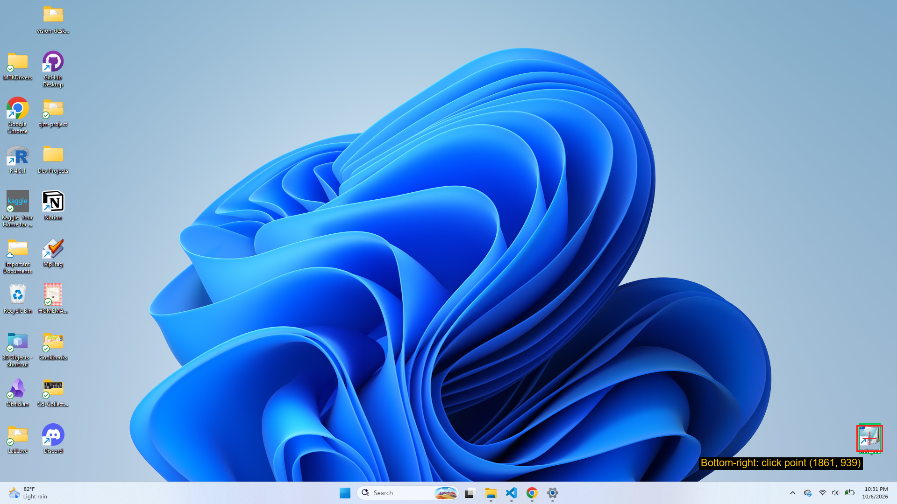

# Vision-Based Desktop Automation with Dynamic Icon Grounding

This program finds an icon on the Windows 11 desktop from a screenshot and a text description, double-clicks it to launch it, then types and saves the first 10 JSONPlaceholder posts as `post_{id}.txt` in `Desktop\tjm-project`, searching for the icon again before each post. The icon primarily used to test this program was Notepad, however it was also tested with the Recycle Bin. This follows the ScreenSeekeR method from ScreenSpot-Pro, however, it uses Claude as planner, grounder and verifier. It is designed to find the icon wherever it sits on the desktop, and icons were moved to several different positions to test this.

## Requirements

- Windows 11, with the Windows 11 version of Notepad (the one with tabs)
- 1920x1080 at 100% display scaling, single monitor
- A Notepad shortcut on the desktop, visible when the desktop is shown
- [uv](https://docs.astral.sh/uv/) installed (it manages Python 3.12 or newer)
- Internet access (JSONPlaceholder and the Anthropic API) and an Anthropic API key with credit
- Screen kept on and unlocked while it runs


## Setup

```powershell
uv sync
```

Set your API key for the current PowerShell window:

```powershell
$env:ANTHROPIC_API_KEY = "sk-ant-..."
```

Or put `ANTHROPIC_API_KEY=sk-ant-...` in a file named `.env` in the repository root (it is gitignored and must never be committed).

If `uv sync` fails with a hardlink error on Windows, run `$env:UV_LINK_MODE = "copy"` and try again.

Then check the setup:

```powershell
uv run vision-automation check
```

This confirms the key works, that the model (`claude-sonnet-5-5`) is in your account's model list, that the effort setting (`medium`) is accepted, and that an image request works.

## Usage

> **Warning: a run takes over your mouse and keyboard for about 7 to 10 minutes. Do not touch them while it runs. To abort, move the mouse all the way into any screen corner.**

```powershell
uv run vision-automation run              # the first 10 posts (default)
uv run vision-automation run --posts 3    # only the first 3
```

Put the Notepad icon anywhere on the desktop; the program searches for it again before every post. It stops at the first failure, names the post and step, saves a screenshot to `debug/`, and leaves Notepad open.

**Dry run** (never clicks or types): show the desktop (Win+D), then run:

```powershell
uv run vision-automation locate --name icon_center
```

The annotated screenshot is saved to `output/annotated/icon_center.png`. Every search also writes a trace to `debug/traces/` (gitignored). Other commands (`screenshot`, `ground`, `plan`, `verify`) test single stages; see `uv run vision-automation --help`.


## Results: annotated screenshots

Each image shows the verified click point (red crosshair) and the grounded box (green) for the Notepad icon.

**Top-left**


**Center**



**Bottom-right**



## How the grounding works

Finding a small icon on a large desktop is difficult and error-prone for AI models. Instead of asking for the icon on the whole screenshot at once, this program looks at the desktop as a whole, then zooms in on the most likely areas.

1. It first checks that nothing like a pop-up is blocking the desktop.
2. Claude guesses where the icon probably is, and what is usually near it.
3. Those guesses are located on the screenshot and ranked, so places that several guesses point to come first.
4. The program zooms into the best place and repeats, until the area is small enough to point at the icon.
5. Before clicking, a separate Claude check looks closely at the spot and answers "is this really the Notepad icon?" Only a confirmed spot is clicked.
6. If nothing is confirmed, it stops, saves a screenshot for debugging, and does not guess.

This follows the method in the ScreenSpot-Pro paper (arXiv 2504.07981). The details, and where I differ from the paper, are in [`design.md`](design.md) and the deviations section below.


## Where I differ from the paper

- **Models.** The paper uses GPT-4o as the planner and a separate model trained for pointing. I use Claude (Sonnet 5.5- Medium) for the planner, the pointing step and the verifier, each with its own prompt. I chose this because of my machine and the time limit.
- **Pop-up check.** Before each search I check for a blocking pop-up. This is not in the paper.
- **Taskbar rule.** The taskbar also has a Notepad icon, so when the description says "not the taskbar", anything found there is rejected.
- **Safety limits.** A search stops after 40 model calls, and it won't search a region as big as the one it is already in.
- **Settings the paper doesn't give.** How much to grow a region, how much overlap to merge, how deep to zoom, and how small a region must be before pointing are my own choices, tuned after few test runs.
- **Left out.** The paper's method reuses a clearer description from the verifier when it rejects a spot. Mine logs it but doesn't act on it.

## Tested vs. not tested

**Tested**
- A full 10-post run with the icon in the center: all ten saved files matched the JSONPlaceholder text exactly (checked with a script)
- Shorter runs (1 to 5 posts) with the icon at top-left, bottom-right and lower center-right
- A fresh clone of the repo: `uv sync`, `uv run pytest` and `uv run vision-automation check` all passed, and it saved a post
- Windows 11 at 1920x1080 and 100% scaling
- Windows dark mode: one dry run and one full post
- A dry run searching for the Recycle Bin, which found it
- A dry run searching for an icon that isn't on the desktop (Photoshop), which returned "not found" without clicking anything
- 241 automated tests (`uv run pytest`). The models, screen and Windows dialogs are simulated in these, so they check the logic (scoring, coordinate mapping, search, workflow ordering, Save As retries, typing repair), not Claude's behaviour.

**Not tested**
- Windows 10
- Other themes (beyond the one dark-mode run) or other icon sizes
- Multiple monitors, or other scalings and resolutions
- A Claude API outage in the middle of a search
- Live pop-up dismissal. The pop-up check runs on every search, but clicking a real pop-up's close button has only been exercised with simulated pop-ups.


## What a run does to the computer

Before you run it, know that it:

- **Sends screenshots of your desktop to the Anthropic API** on every search, so be mindful of what is on the screen. If a search fails, a screenshot is also saved to `debug/` on your computer.
- **Minimizes all your windows** (Win+D) before each search, and does not restore them.
- **Closes any open Notepad window** first. If Notepad asks to save changes, the program cancels the prompt and stops; it never discards your work. Save anything you want to keep in Notepad before running it.
- **Overwrites existing `post_N.txt` files** in `Desktop\tjm-project`, and creates the folder if it's missing.
- **Moves the mouse pointer** to the taskbar before each screenshot, so a tooltip can't cover the icon.


## Known limitations

- **Windows 11 Notepad only.** The typing check reads text from the Windows 11 Notepad's editor, which the older Notepad doesn't have.
- **Autocorrect slows typing.** Notepad rewrites some words as they are typed (for example "commodi" becomes "commode"), so the program checks and fixes each word. A post takes about 10 seconds to type instead of 6.
- **It is slow.** A search takes roughly 7 to 25 model calls and 12 to 60 seconds depending on where the icon is, and a full 10-post run took about 7 minutes. I haven't measured the cost of a single run; building and testing the whole project used about $5 of API credit.
- **The search is guided, not exhaustive.** If the icon isn't in any region it tries, it fails instead of scanning the whole screen. Wrong neighbor hints can also push the right region down the list, which happened once.
- **Claude checks Claude.** The verifier is the same model as the planner and grounder, so its check isn't fully independent.


## How I used Claude Code

I read the ScreenSpot-Pro paper provided and wrote the design document before any coding began. I used Claude to talk through the plan, review my design doc and help me read logs and failure screenshots. I then gave Claude Code the assignment requirements, my design and the paper's method, and used it (Sonnet 5.5, medium effort, in plan mode) to build the project in small steps. For each step I reviewed its plan, answered its questions and decided what to change, then ran the result on my own desktop before moving on. I checked the annotated screenshots myself, and compared all ten saved posts against the JSONPlaceholder text with a script, in order to verify accurate results.
